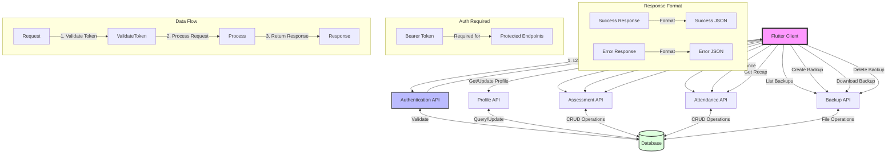
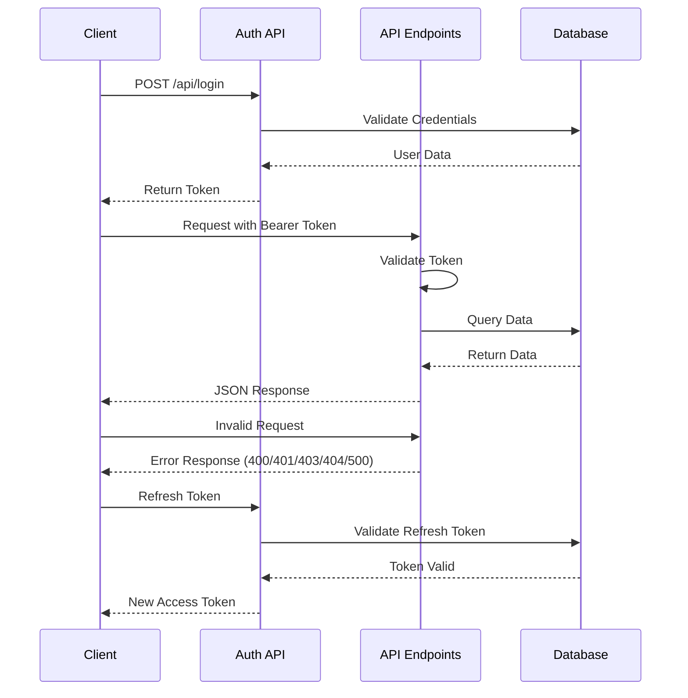
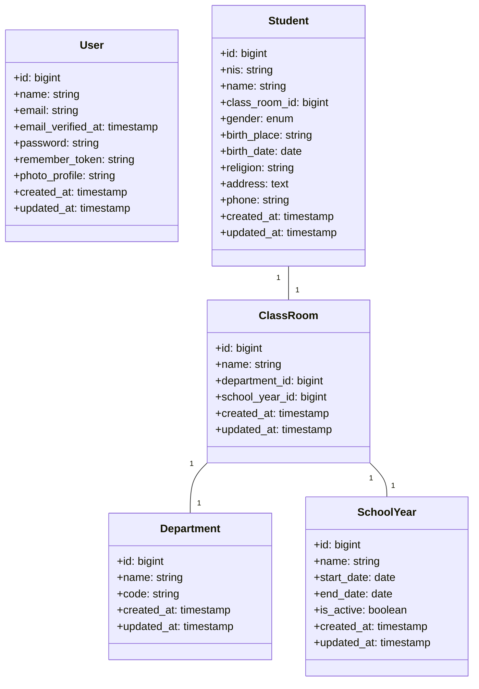
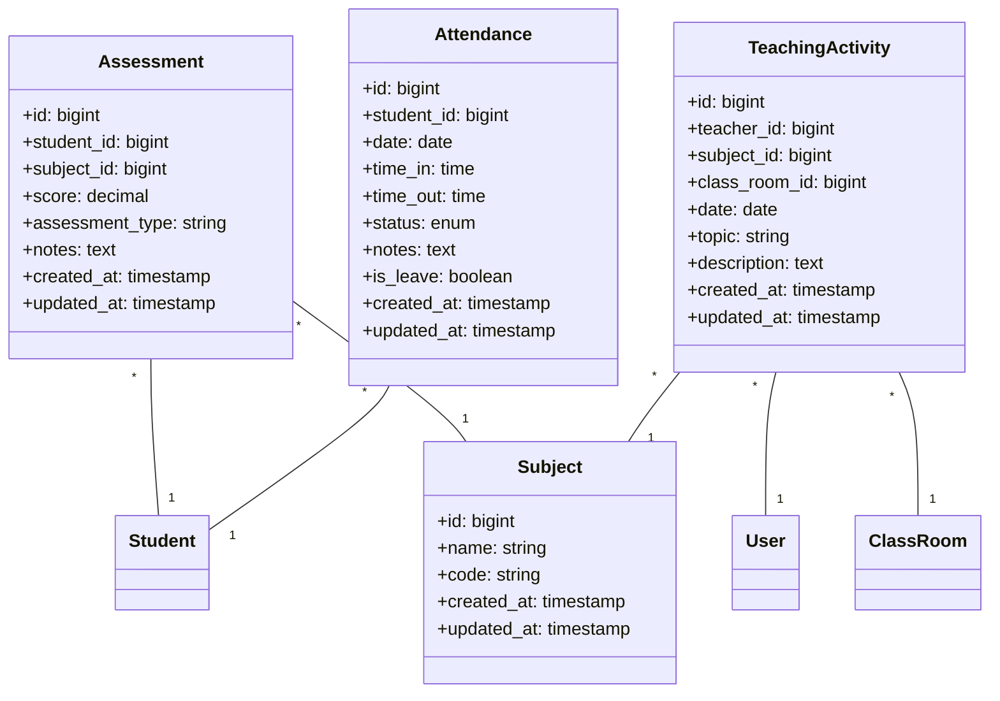
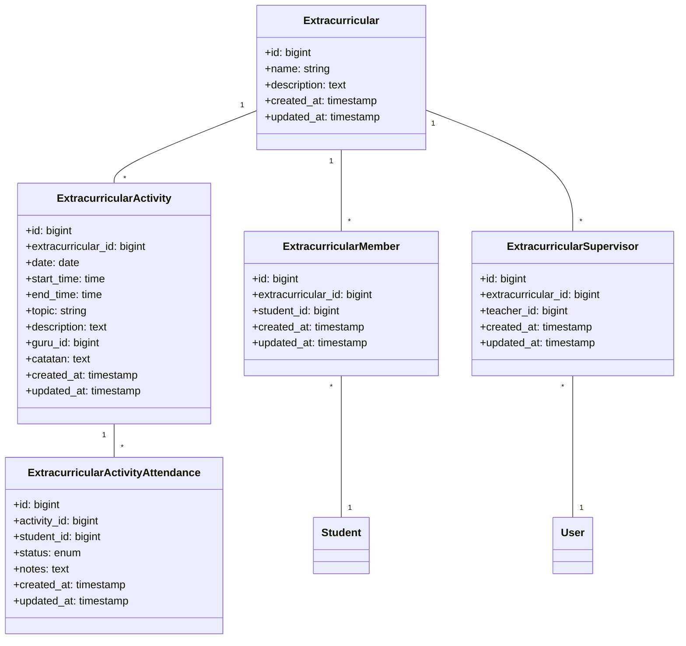
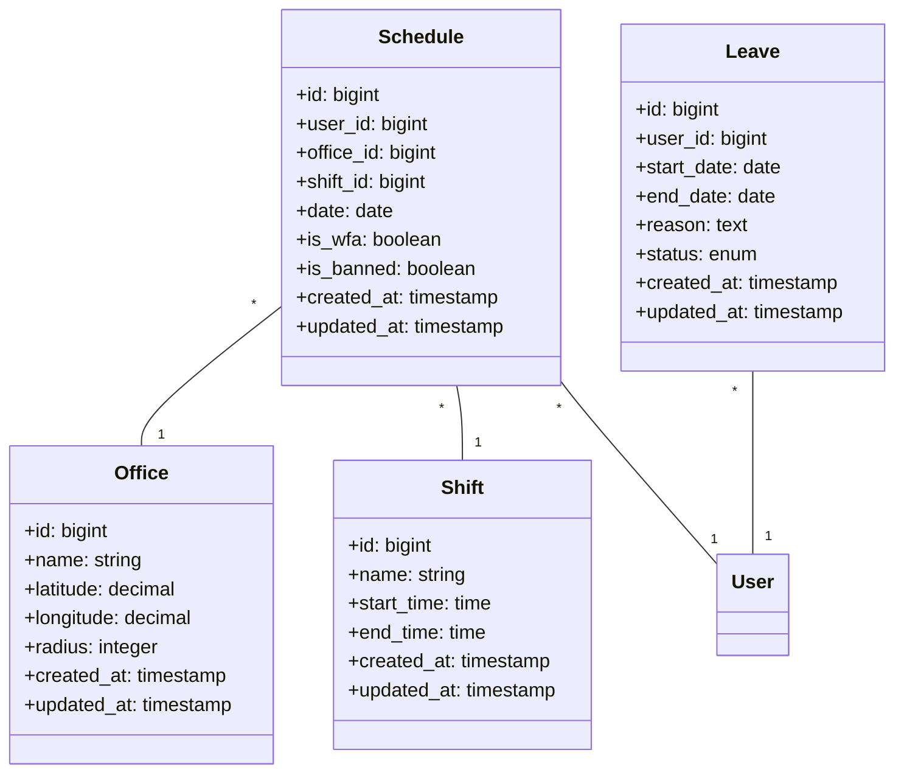
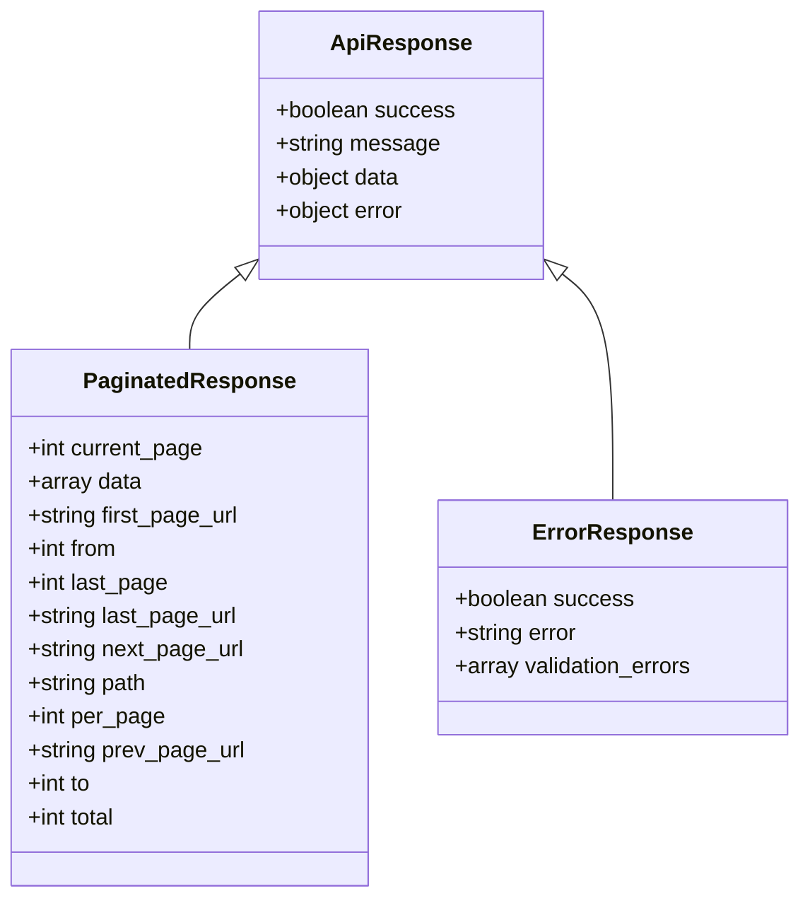

# Dokumentasi Diagram Sistem

## 1. Alur Sistem

### 1.1 Alur Umum Sistem

### 1.2 Sequence Diagram Autentikasi

## 2. Struktur Database

### 2.1 Tabel Utama

### 2.2 Tabel Penilaian dan Absensi

### 2.3 Tabel Ekstrakurikuler

### 2.4 Tabel Absensi Guru dan Jadwal

## 3. Format Response API

## Catatan Penting:

1. Semua endpoint API memerlukan autentikasi menggunakan Bearer Token, kecuali endpoint login.
2. Format response konsisten menggunakan struktur ApiResponse.
3. Untuk data yang banyak, digunakan PaginatedResponse.
4. Setiap error akan menggunakan format ErrorResponse.
5. Relasi antar tabel menggunakan foreign key constraints untuk menjaga integritas data.